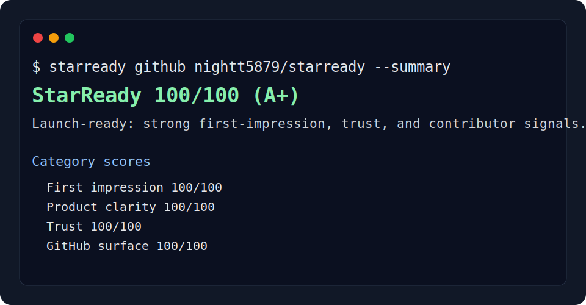

# StarReady

[](https://github.com/nightt5879/starready/actions/workflows/ci.yml)


StarReady helps open-source maintainers audit whether a GitHub repository is clear, trustworthy, and easy to share before launch.



## Why

Most promising repositories lose visitors in the first minute. The README is vague, the demo is missing, the license is unclear, the install command is buried, or contributors cannot tell how to help.

StarReady turns those adoption signals into a local score and a prioritized fix list. It does not buy, fake, or guarantee stars; it helps remove the friction that keeps useful projects from being tried, shared, and contributed to.

## Quickstart

```bash
npx starready .
```

Write a Markdown report and fail CI when the repository is not ready enough:

```bash
npx starready . --markdown STARREADY_REPORT.md --fail-below 80
```

Get a compact terminal summary:

```bash
npx starready ../your-repo --summary
```

## Installation

Use it without installing:

```bash
npx starready .
```

Or install it globally:

```bash
npm install -g starready
starready .
```

## Usage

```bash
starready [path] [options]
```

| Option | Description |
| --- | --- |
| `--markdown [file]` | Print Markdown, or write it to a file when a path is provided. |
| `--json` | Print machine-readable JSON. |
| `--summary` | Print a compact text summary. |
| `--output, -o <file>` | Write the selected format to a file. |
| `--fail-below <score>` | Exit with code 1 when the score is below the threshold. |
| `--strict` | Same as `--fail-below 85`. |

## What StarReady Checks

StarReady scores five areas that strongly affect whether a visitor tries or shares a project:

| Area | Signals |
| --- | --- |
| First impression | README, crisp promise, screenshot or demo, quickstart, badges. |
| Product clarity | problem statement, install path, usage examples, docs, roadmap. |
| Trust | license, CI, tests, security policy, contribution guide, changelog. |
| Engineering | manifest, commands, runtime constraints, source layout, dependency footprint. |
| Community | issue templates, code of conduct, keywords, launch assets. |

## Examples

Generate JSON for another tool:

```bash
starready . --json --output starready.json
```

Use StarReady in GitHub Actions:

```yaml
name: StarReady

on:
  pull_request:
  push:
    branches: [main]

jobs:
  audit:
    runs-on: ubuntu-latest
    steps:
      - uses: actions/checkout@v4
      - uses: actions/setup-node@v4
        with:
          node-version: 20
      - run: npx starready . --summary --fail-below 80
```

## Roadmap

- GitHub API mode for repository topics, releases, discussions, and star velocity.
- `starready compare` to compare two repositories or branches.
- Custom scoring profiles for libraries, apps, CLIs, templates, and research repos.
- Generated launch packs with announcement copy, demo checklist, and issue labels.

## Comparison

StarReady is not a code quality scanner and not a marketing automation tool. It focuses on the public repository surface: the signals a developer sees before they decide to install, star, share, or contribute.

## Contributing

Run the project locally:

```bash
npm install
npm test
node bin/starready.js . --summary
```

Good first contributions include new checks, better evidence messages, and report formats for CI dashboards.

## License

MIT
